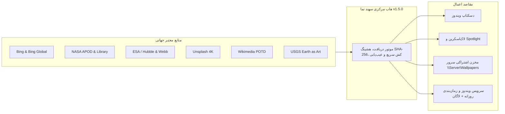

<div dir="rtl" align="right" style="font-family: 'Vazirmatn', Tahoma, -apple-system, BlinkMacSystemFont, 'Segoe UI', Roboto, sans-serif; line-height: 1.8;">

# سهند نما | Sahand Nama (نسخه 1.5.0)

**سامانه جامع، هوشمند و سازمانی مدیریت و به‌روزرسانی تصاویر پس‌زمینه و صفحه قفل ویندوز**  
*طراحی و توسعه توسط شرکت راهکار الکترونیک سهند — [https://irres.ir](https://irres.ir)*

[](https://github.com/taimazus/SetWinWallpaper/releases/latest)
[](docs/ARCHITECTURE.md)
[](docs/ENTERPRISE_DEPLOYMENT.md)
[](https://github.com/taimazus/SetWinWallpaper/releases/latest)
[](BingWallpaperPro/Assets/Fonts/OFL.txt)

---

## 📥 دریافت و دانلود مستقیم خروجی ویندوز (Downloads)

برای استفاده از نرم‌افزار بدون نیاز به نصب هرگونه پیش‌نیاز یا دات‌نت، می‌توانید نسخه‌های آماده ۶۴بیتی را مستقیماً از بخش **Releases** گیت‌هاب دانلود کنید:

| نوع فایل | لینک دانلود مستقیم از گیت‌هاب | حجم تقریبی | مناسب برای |
| :--- | :--- | :--- | :--- |
| 🚀 **فایل اجرایی مستقل (EXE)** | [**دانلود SahandNama-v1.5.0-win-x64.exe**](https://github.com/taimazus/SetWinWallpaper/releases/download/v1.5.0/SahandNama-v1.5.0-win-x64.exe) | ~۵۰ مگابایت | اجرای فوری با یک کلیک بدون استخراج |
| 📦 **بسته پرتابل فشرده (ZIP)** | [**دانلود BingWallpaperPro-win-x64.zip**](https://github.com/taimazus/SetWinWallpaper/releases/download/v1.5.0/BingWallpaperPro-win-x64.zip) | ~۵۹ مگابایت | پکیج کامل شامل اسکریپت‌های PowerShell و راهنما |
| 🏷️ **صفحه انتشار نسخه‌ها** | [**مشاهده تمام Releaseها در گیت‌هاب**](https://github.com/taimazus/SetWinWallpaper/releases) | — | تاریخچه تغییرات و دسترسی به تمام نسخه‌ها |

---

## 🌟 معرفی پروژه

«سهند نما» یک نرم‌افزار مدرن، مستقل و بومی‌سازی‌شده با فونت فارسی **Vazirmatn** است که به کاربران و سازمان‌ها امکان می‌دهد تصاویر پس‌زمینه دسکتاپ و صفحه قفل ویندوز (ویندوز ۱۰، ۱۱ و سرورهای ۲۰۱۹ به بعد) را از معتبرترین منابع جهانی به طور خودکار دریافت کرده، در شبکه توزیع کنند، مصرف اینترنت را به حداقل برسانند و ایرادات ویندوز و Spotlight را با یک کلیک عیب‌یابی و خودترمیمی نمایند.



---

## 📚 ساختار مستندات و دانشنامه (Documentation & Wiki)

برای مطالعه راهنماهای تفصیلی و تخصصی به بخش‌های زیر مراجعه فرمایید:

| مستند | شرح و موضوع |
| :--- | :--- |
| 📖 **[راهنمای جامع کاربری HTML (Guide.fa.html)](BingWallpaperPro/Guide.fa.html)** | راهنمای تعاملی، تصویری و کامل کاربر با طراحی شکیل Dark Mode |
| 📐 **[معماری و دیاگرام‌ها (docs/ARCHITECTURE.md)](docs/ARCHITECTURE.md)** | تحلیل معماری، الگوهای طراحی، دیاگرام‌های توالی و جریان داده‌ها |
| 🏢 **[استقرار سازمانی (docs/ENTERPRISE_DEPLOYMENT.md)](docs/ENTERPRISE_DEPLOYMENT.md)** | راهنمای هاب سرور، اشتراک شبکه (UNC Share)، تنظیمات GPO و کاهش پهنای باند |
| 🔍 **[عیب‌یابی Spotlight (docs/SPOTLIGHT_TROUBLESHOOTING.md)](docs/SPOTLIGHT_TROUBLESHOOTING.md)** | بررسی علل خرابی، پاک‌سازی کش و بازنشانی بسته‌های ContentDeliveryManager |
| 🌐 **[منابع و APIها (docs/SOURCES_AND_API.md)](docs/SOURCES_AND_API.md)** | جزئیات فیدها، کیفیت 4K، پروتکل‌های امنیتی و الگوریتم یکتاسازی SHA-256 |
| ⌨️ **[خط فرمان و اسکریپت‌ها (docs/CLI_AND_SCRIPTS.md)](docs/CLI_AND_SCRIPTS.md)** | آرگومان‌های خاموش (Silent)، مدیریت تسک‌ها و سرویس ویندوز |
| 🏛️ **[دانشنامه پروژه (wiki/Home.md)](wiki/Home.md)** | صفحه اصلی ویکی شامل راهنمای کاربری، ادمین و توسعه‌دهندگان |

---

## ✨ امکانات برجسته نسخه 1.5.0

1. **سامانه زمان‌بندی هوشمند چندرویدادی (Resilient Multi-Trigger Scheduler):**
   - اجرای مستقل از Culture (سازگار کامل با انواع تقویم‌ها و فرمت‌های زمان ویندوز).
   - اجرای همزمان بر اساس ساعت روزانه (`Daily`) و رویداد ورود به ویندوز (`AtLogOn`).
   - اجرای خودکار بعد از روشن شدن سیستم در صورت خاموش بودن در زمان مقرر (`StartWhenAvailable`).
   - عدم توقف در زمان آفلاین بودن با تکیه بر کش محلی و آرشیو موجود.
2. **سرویس ویندوز هماهنگ با SCM (Windows NT Service):**
   - اجرای کاملاً غیرمسدودکننده (Non-blocking async loop) و پاسخگویی آنی به فرامین توقف سرویس.
   - امکان نصب، راه‌اندازی، حذف و بررسی سرویس مستقیماً از داخل برنامه و خط فرمان با UAC Elevation.
3. **کش سریع حافظه‌ای تصاویر بندانگشتی (In-Memory Thumbnail Cache):**
   - شتاب‌بخشی ۱۰ برابری به اسکرول گالری و به حداقل رساندن I/O دیسک.
4. **مخزن مرکزی سرور (Enterprise Server Hub):**
   - دانلود متمرکز تمام منابع روزانه در سرور و تغذیه کلاینت‌ها از مسیر شبکه `\\Server\Wallpapers` بدون مصرف اینترنت.
5. **تنوع گسترده تصاویر جهانی:**
   - مایکروسافت بینگ و گلچین چندمنطقه‌ای قاره‌ها (`BingGlobal`)
   - برگزیده عکاسی باکیفیت 4K طبیعت، کوهستان و شهرهای دنیا (`UnsplashNature`)
   - تصویر برگزیده روز ویکی‌مدیا از فرهنگ، تاریخ و شاهکارهای عکاسی (`WikimediaPotd`)
   - شگفتی‌های زمین‌شناسی از فضا ثبت‌شده با ماهواره‌های لندست (`UsgsEarthArt`)
   - تصویر نجومی روز ناسا (`NasaDaily`) و تصاویر تلسکوپ‌های هابل و جیمز وب (`EsaHubble`)
6. **الگوریتم یکتاسازی هوشمند (SHA-256 Deduplication):**
   - مقایسه محتوایی تصاویر و حذف خودکار فایل‌های تکراری و مشابه از دیسک.
7. **مرکز عیب‌یابی و رفع خودکار ۲۲ گانه:**
   - تعمیر رجیستری، زمان‌بندی، فایل‌های تنظیمات، حافظه کش، و بازسازی عمیق پکیج‌های Spotlight.
8. **نسخه کاملاً مستقل و پرتابل:**
   - بدون نیاز به نصب هرگونه پیش‌نیاز یا دات‌نت بر روی کلاینت‌ها یا سرورها.

---

## 🛠️ کامپایل و اجرای آزمون‌ها

```powershell
# اجرای ۵۷ آزمون فنی و اعتبارسنجی
dotnet run --project BingWallpaperPro.Tests\BingWallpaperPro.Tests.csproj

# ساخت و انتشار خروجی نهایی مستقل ۶۴بیتی
dotnet publish BingWallpaperPro\BingWallpaperPro.csproj -c Release -r win-x64 --self-contained true -o artifacts\standalone
```

</div>
