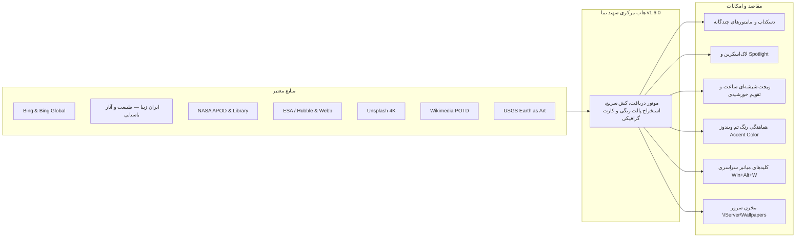

<div dir="rtl" align="right" style="font-family: 'Vazirmatn', Tahoma, -apple-system, BlinkMacSystemFont, 'Segoe UI', Roboto, sans-serif; line-height: 1.8;">

# سهند نما | Sahand Nama (نسخه 1.6.0)

**سامانه جامع، هوشمند و سازمانی مدیریت و به‌روزرسانی تصاویر پس‌زمینه و صفحه قفل ویندوز**  
*طراحی و توسعه توسط شرکت راهکار الکترونیک سهند — [https://irres.ir](https://irres.ir)*

[](https://github.com/taimazus/SetWinWallpaper/releases/latest)
[](docs/ARCHITECTURE.md)
[](docs/ENTERPRISE_DEPLOYMENT.md)
[](https://github.com/taimazus/SetWinWallpaper/releases/latest)
[](BingWallpaperPro/Assets/Fonts/OFL.txt)

---

## 📥 دریافت و دانلود مستقیم خروجی ویندوز (Downloads)

برای استفاده از نرم‌افزار بدون نیاز به نصب هرگونه پیش‌نیاز یا دات‌نت، می‌توانید نسخه‌های آماده ۶۴بیتی را مستقیماً از بخش **Releases** گیت‌هاب دانلود کنید:

| نوع فایل | لینک دانلود مستقیم از گیت‌هاب | حجم تقریبی | مناسب برای |
| :--- | :--- | :--- | :--- |
| 🚀 **فایل اجرایی مستقل (EXE)** | [**دانلود SahandNama-v1.6.0-win-x64.exe**](https://github.com/taimazus/SetWinWallpaper/releases/download/v1.6.0/SahandNama-v1.6.0-win-x64.exe) | ~۱۴۰ مگابایت | اجرای فوری با یک کلیک بدون استخراج |
| 📦 **بسته پرتابل فشرده (ZIP)** | [**دانلود SahandNama-v1.6.0-win-x64.zip**](https://github.com/taimazus/SetWinWallpaper/releases/download/v1.6.0/SahandNama-v1.6.0-win-x64.zip) | ~۶۱ مگابایت | پکیج کامل شامل اسکریپت‌های PowerShell و راهنما |
| 🏷️ **صفحه انتشار نسخه‌ها** | [**مشاهده تمام Releaseها در گیت‌هاب**](https://github.com/taimazus/SetWinWallpaper/releases) | — | تاریخچه تغییرات و دسترسی به تمام نسخه‌ها |

---

## 🌟 معرفی پروژه

«سهند نما» یک نرم‌افزار مدرن، مستقل و بومی‌سازی‌شده با فونت فارسی **Vazirmatn** است که به کاربران و سازمان‌ها امکان می‌دهد تصاویر پس‌زمینه دسکتاپ و صفحه قفل ویندوز (ویندوز ۱۰، ۱۱ و سرورهای ۲۰۱۹ به بعد) را از معتبرترین منابع جهانی به طور خودکار دریافت کرده، در شبکه توزیع کنند، مصرف اینترنت را به حداقل برسانند و ایرادات ویندوز و Spotlight را با یک کلیک عیب‌یابی و خودترمیمی نمایند.



---

## 📚 ساختار مستندات و دانشنامه (Documentation & Wiki)

برای مطالعه راهنماهای تفصیلی و تخصصی به بخش‌های زیر مراجعه فرمایید:

| مستند | شرح و موضوع |
| :--- | :--- |
| 📖 **[راهنمای جامع کاربری HTML (Guide.fa.html)](BingWallpaperPro/Guide.fa.html)** | راهنمای تعاملی، تصویری و کامل کاربر با طراحی شکیل Dark Mode |
| 📐 **[معماری و دیاگرام‌ها (docs/ARCHITECTURE.md)](docs/ARCHITECTURE.md)** | تحلیل معماری، الگوهای طراحی، دیاگرام‌های توالی و جریان داده‌ها |
| 🏢 **[استقرار سازمانی (docs/ENTERPRISE_DEPLOYMENT.md)](docs/ENTERPRISE_DEPLOYMENT.md)** | راهنمای هاب سرور، اشتراک شبکه (UNC Share)، تنظیمات GPO و کاهش پهنای باند |
| 🔍 **[عیب‌یابی Spotlight (docs/SPOTLIGHT_TROUBLESHOOTING.md)](docs/SPOTLIGHT_TROUBLESHOOTING.md)** | بررسی علل خرابی، پاک‌سازی کش و بازنشانی بسته‌های ContentDeliveryManager |
| 🌐 **[منابع و APIها (docs/SOURCES_AND_API.md)](docs/SOURCES_AND_API.md)** | جزئیات فیدها، کیفیت 4K، پروتکل‌های امنیتی و الگوریتم یکتاسازی SHA-256 |
| ⌨️ **[خط فرمان و اسکریپت‌ها (docs/CLI_AND_SCRIPTS.md)](docs/CLI_AND_SCRIPTS.md)** | آرگومان‌های خاموش (Silent)، کلیدهای میانبر و سرویس ویندوز |
| 🏛️ **[دانشنامه پروژه (wiki/Home.md)](wiki/Home.md)** | صفحه اصلی ویکی شامل راهنمای کاربری، ادمین و توسعه‌دهندگان |

---

## ✨ امکانات برجسته نسخه 1.6.0

1. ⌨️ **کلیدهای میانبر سراسری ویندوز (Global Hotkeys):**
   - کلید `Win + Alt + W`: دریافت و اعمال فوری والپیپر بعدی بدون نیاز به باز کردن پنجره برنامه.
   - کلید `Win + Alt + S`: افزودن سریع تصویر فعال به فهرست علاقه‌مندی‌ها.
2. 🕒 **ویجت شیشه‌ای دسکتاپ (Glassmorphism Desktop Widget):**
   - نمایش ساعت دیجیتال زنده، تقویم و تاریخ روز هجری خورشیدی (شمسی)، نام منظره و دکمه‌های کنترل سریع روی دسکتاپ با طراحی مات و مدرن.
3. 🏛️ **کالکشن اختصاصی «ایران زیبا» (Iran Nature & Heritage):**
   - دسترسی به تصاویر باکیفیت از طبیعت شگفت‌انگیز، کوهستان‌ها و میراث باستانی ایران (دماوند، سهند، تخت جمشید، کویر لوت، ماسوله، پل خواجو، باداب سورت، دره ستارگان قشم و جنگل‌های هیرکانی).
4. 🖥️ **پشتیبانی از چندین مانیتور (Multi-Monitor Customization):**
   - امکان اعمال تصاویر روی تمام مانیتورهای متصل به سیستم از طریق رابط پیشرفته Win32 `IDesktopWallpaper`.
5. 🎨 **هماهنگ‌سازی خودکار رنگ تم ویندوز (Accent Color Sync):**
   - استخراج هوشمند رنگ غالب تصویر روز و تنظیم خودکار Accent Color ویندوز متناسب با منظره.
6. 📤 **تولید کارت گرافیکی اشتراک‌گذاری (Social Share Card Generator):**
   - ساخت کارت گرافیکی باکیفیت و آماده انتشار در اینستاگرام و تلگرام همراه با تاریخ شمسی، عنوان تصویر، منبع و برند سهند نما با یک کلیک.
7. 🧹 **حالت دسکتاپ تمیز (Clean Desktop Icons):**
   - قابلیت پنهان/نمایان‌سازی سریع آیکون‌های دسکتاپ برای لذت بردن از والپیپر به عنوان یک قاب عکس دیجیتال زنده.
8. ⏰ **سامانه زمان‌بندی هوشمند چندرویدادی (Multi-Trigger Scheduler):**
   - اجرای مستقل از Culture در ساعت مقرر (`Daily`) و هنگام ورود کاربر (`AtLogOn`) با قابلیت `StartWhenAvailable`.
9. 🏢 **مخزن مرکزی سرور (Enterprise Server Hub):**
   - دانلود متمرکز تمام منابع روزانه در سرور و تغذیه کلاینت‌ها از مسیر شبکه `\\Server\Wallpapers` بدون مصرف اینترنت.
10. 🛠️ **مرکز عیب‌یابی و خودترمیمی خودکار:**
    - بررسی جامع رجیستری، سرویس‌ها، تسک‌ها، کش و بازنشانی کامل Windows Spotlight با یک کلیک.

---

## 🛠️ کامپایل و اجرای آزمون‌ها

```powershell
# اجرای ۶۳ آزمون فنی و اعتبارسنجی
dotnet run --project BingWallpaperPro.Tests\BingWallpaperPro.Tests.csproj

# ساخت و انتشار خروجی نهایی مستقل ۶۴بیتی
dotnet publish BingWallpaperPro\BingWallpaperPro.csproj -c Release -r win-x64 --self-contained true -o artifacts\standalone
```

</div>
