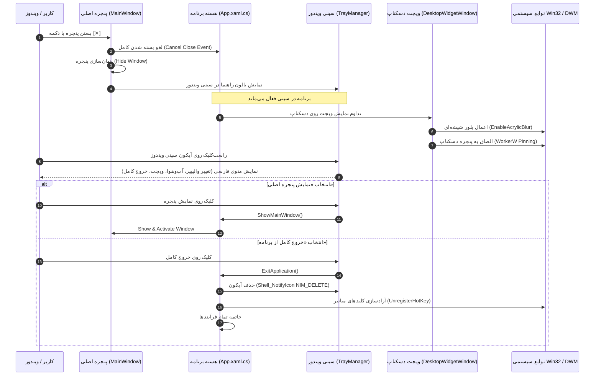
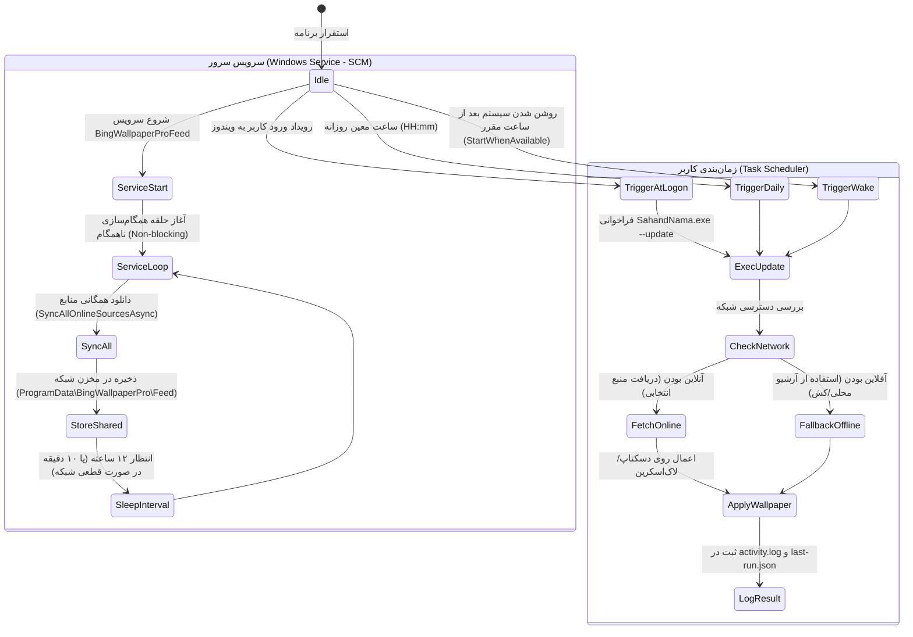
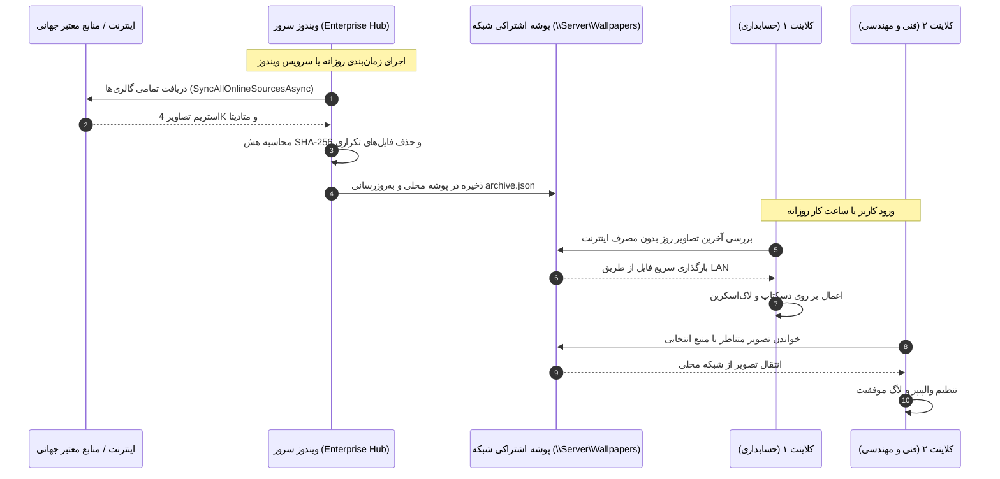
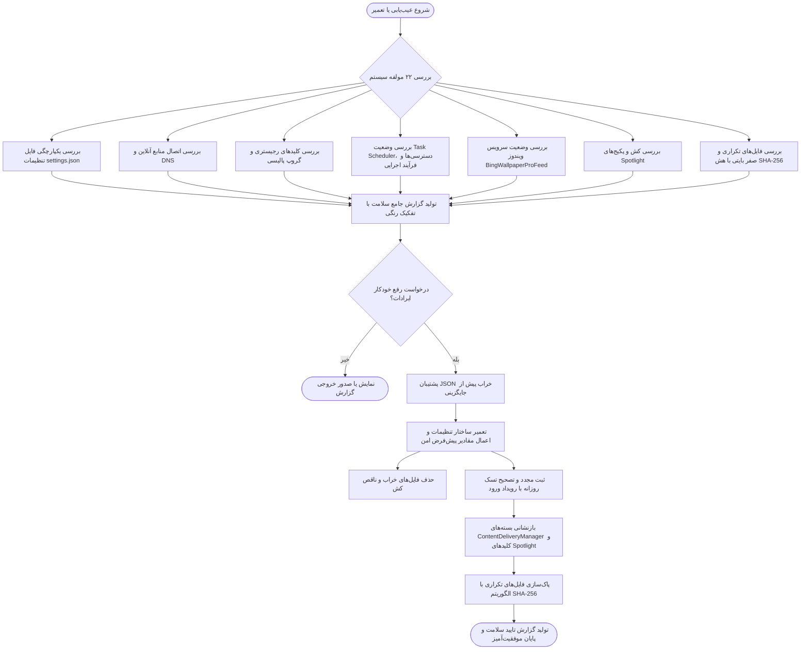

# معماری فنی و دیاگرام سیستم — سهند نما (Sahand Nama Architecture)

**نسخه:** 1.8.1
**توسعه‌دهنده:** شرکت راهکار الکترونیک سهند ([https://irres.ir](https://irres.ir))  
**فناوری:** .NET 10.0 (C# 13), WPF (Windows Presentation Foundation), Win32 Native P/Invoke, DWM Acrylic Blur, PowerShell Native Bridge, SCM Windows Service Dispatcher.

---

## ۱. نمای کلی معماری (High-Level Architecture)

نرم‌افزار سهند نما بر پایه الگوی معماری ماژولار با حداقل وابستگی جانبی (Zero Third-Party Dependency) طراحی شده است. تمام عملیات شبکه، تجزیه داده‌ها، بهینه‌سازی تصاویر، ویجت شیشه‌ای و تعامل با ویندوز از طریق کامپوننت‌های بهینه‌سازی‌شده درون برنامه انجام می‌شود.

```mermaid
graph TD
    UI["رابط کاربری مدرن WPF<br/>(MainWindow & Theme.xaml)"] --> Cache["کش سریع حافظه‌ای تصاویر بندانگشتی<br/>(ThumbnailConverter Concurrent Cache)"]
    UI --> Controller["کنترلر مرکزی و موتور پس‌زمینه<br/>(WallpaperEngine)"]
    
    WID["ویجت شیشه‌ای دسکتاپ<br/>(DesktopWidgetWindow Acrylic Blur)"] --> WService["سرویس زنده آب‌وهوا<br/>(WeatherService Open-Meteo)"]
    WID --> HMonitor["پایشگر سخت‌افزار سیستم<br/>(HardwareMonitor CPU/RAM/Battery)"]
    WID --> DPin["الصاق به شل دسکتاپ<br/>(DesktopPinning WorkerW)"]
    
    TRY["مدیریت سینی ویندوز<br/>(TrayManager Shell_NotifyIcon)"] --> AppCtrl["چرخه حیات برنامه و خروج دوگانه<br/>(App.xaml.cs Lifecycle)"]

    subgraph Core Engine ["موتور مرکزی (Core Engine v1.8.1)"]
        Controller --> Prefs["مدیریت تنظیمات و ذخیره‌سازی اتمیک<br/>(Preferences & Store)"]
        Controller --> LockCoord["مدیریت قفل هم‌زمانی با تلاش مجدد<br/>(Store.AcquireLockAsync)"]
        Controller --> Catalog["کاتالوگ و بارگذاری منابع<br/>(SourceCatalog & SourceHttp)"]
        Controller --> Dedup["سامانه یکتا‌سازی هش SHA-256<br/>(Deduplication Engine)"]
        Controller --> ColorSync["استخراج پالت و تطبیق رنگ تم<br/>(Dominant Color & Accent Sync)"]
        Controller --> SocialCard["سازنده کارت گرافیکی شبکه‌های اجتماعی<br/>(CardGenerator DrawingVisual)"]
    end

    subgraph Data Sources ["منابع تصاویر و داده‌ها (Data Sources)"]
        Catalog --> Bing["Bing Daily & Bing Global"]
        Catalog --> Iran["ایران زیبا (IranNature)"]
        Catalog --> Wallhaven["Wallhaven (خروجی تا ضلع 3840) Wallpapers"]
        Catalog --> Museum["Art Institute collection via Wikimedia Commons"]
        Catalog --> NatGeo["Wikimedia Featured & Wallhaven"]
        Catalog --> NASA["NASA Image of the Day & Library"]
        Catalog --> Hubble["ESA / Hubble & Webb"]
        Catalog --> Unsplash["Unsplash & Picsum 4K"]
        Catalog --> Wiki["Wikimedia POTD"]
        Catalog --> USGS["USGS Earth as Art"]
        Catalog --> UNC["Enterprise UNC Share"]
    end

    subgraph Windows Interop ["تعامل با سیستم‌عامل (Windows Integration)"]
        Controller --> WinAPI["تغییر والپیپر دسکتاپ و چند مانیتور<br/>(SystemParametersInfo & IDesktopWallpaper)"]
        Controller --> LockAPI["سیاست لاک‌اسکرین ویندوز<br/>(PersonalizationCSP & WinRT/PowerShell)"]
        Controller --> TaskSched["زمان‌بندی هوشمند چندرویدادی<br/>(Windows Task Scheduler - Daily + Logon)"]
        Controller --> WinService["سرویس ویندوز هماهنگ با SCM<br/>(BingWallpaperProFeed Service)"]
        Controller --> Hotkeys["کلیدهای میانبر سراسری ویندوز<br/>(RegisterHotKey Win32)"]
        Controller --> DwmBlur["ترکیب بلور اکریلیک دسکتاپ<br/>(SetWindowCompositionAttribute)"]
        Controller --> SpotRepair["تعمیر عمیق Spotlight<br/>(ContentDeliveryManager & AppX)"]
    end
```

---

## ۲. چرخه حیات ویجت شیشه‌ای و سینی سیستم (Desktop Widget & System Tray Lifecycle)

---

## ۳. چرخه حیات زمان‌بندی و سرویس ویندوز (Service & Scheduling Lifecycle)

---

## ۴. دیاگرام توزیع شبکه سرور و کلاینت‌ها (Enterprise Hub & Distribution)

---

## ۵. دیاگرام جریان عیب‌یابی و رفع خودکار ایرادات (Diagnostics & Auto-Repair Flow)

---

## ۶. ماتریس آزمون‌های اعتبارسنجی خودکار (Automated Verification Matrix)

تمام **۷۵ تست پروژه** به صورت مداوم وضعیت‌های زیر را ارزیابی می‌کنند:

1. **امنیت شبکه و ضد نفوذ:** رد کردن تمام URLهای غیرمجاز، پروتکل‌های ناامن، پورت‌های غیررسمی و تلاش‌های SSRF.
2. **عملیات اتمیک فایل و هماهنگی قفل‌ها:** تضمین عدم رها شدن فایل‌های `.tmp`، بازیافت خطای هم‌زمانی و تلاش مجدد با `AcquireLockAsync`.
3. **صحت دکودینگ تصویر و عدم قفل ماندن فایل:** دکود مستقیم، آزاد شدن فوری Handle فایل و کش در حافظه رم.
4. **تطبیق فیدهای بین‌المللی:** پارس کردن فیدهای NASA Image of the Day, Wikimedia POTD, ESA Hubble, Picsum/Unsplash, USGS, Wallhaven, MuseumArt.
5. **مسیریابی هوشمند و تفکیک دسکتاپ و لاک‌اسکرین:** پشتیبانی از حالت‌های مستقل، همزمان، تفکیک مناطق جغرافیایی و کالکشن ایران زیبا.
6. **محیط کاملاً آفلاین کلاینت:** آزمون بدون اینترنت و واکشی مستقیم از Share شبکه.
7. **طراحی بصری و فونت فارسی:** تایید بارگذاری قلم فارسی Vazirmatn، جهت‌بندی RTL، استایل شیشه‌ای `Theme.xaml` و آیکون اختصاصی سهند نما.
8. **ویجت دسکتاپ، آب‌وهوا و سخت‌افزار:** پایش حافظه RAM، محاسبه دمای شهرها، فرمت تاریخ هجری خورشیدی، استخراج پالت رنگ تم ویندوز و ساخت کارت شبکه اجتماعی.

