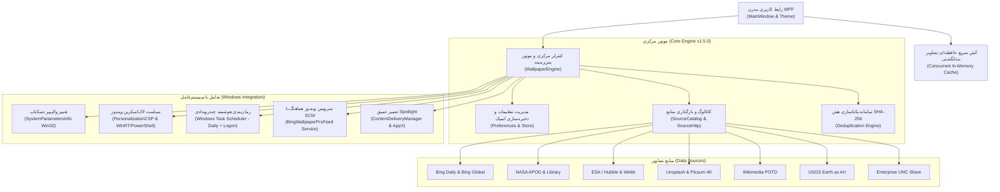
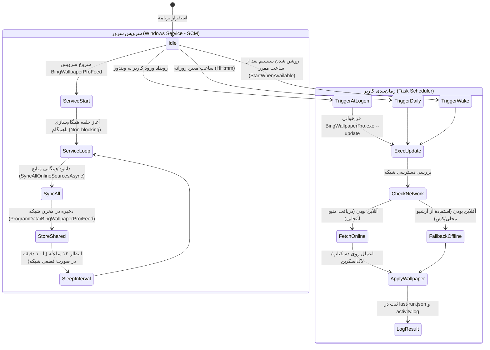
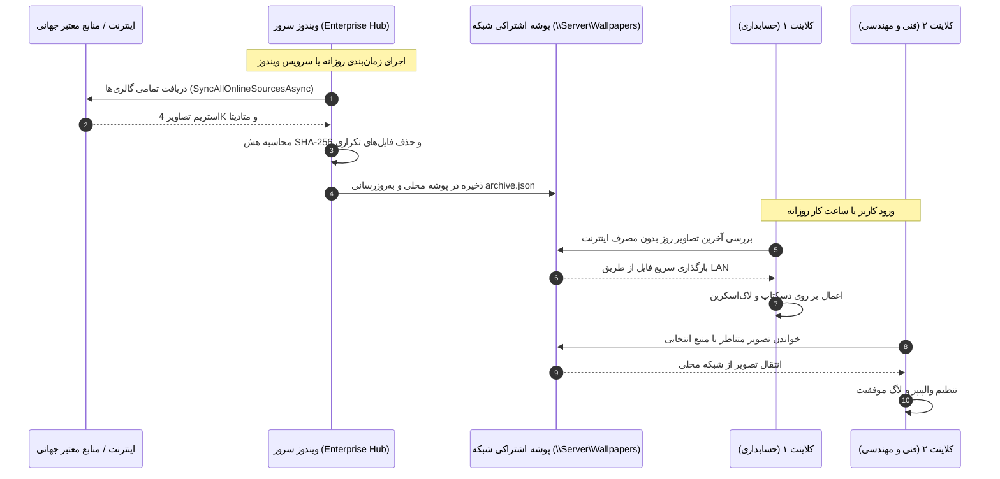
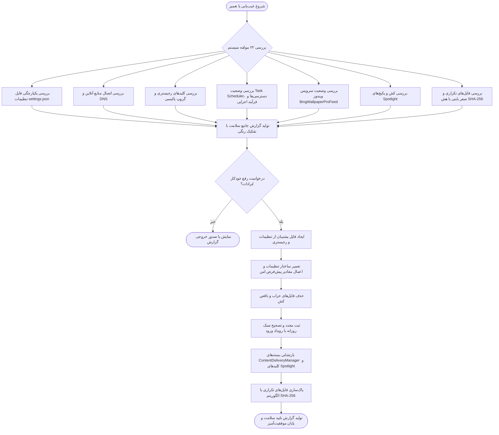

# معماری فنی و دیاگرام سیستم — سهند نما (Sahand Nama Architecture)

**نسخه:** 1.5.0  
**توسعه‌دهنده:** شرکت راهکار الکترونیک سهند ([https://irres.ir](https://irres.ir))  
**فناوری:** .NET 10.0 (C# 13), WPF (Windows Presentation Foundation), PowerShell Native Bridge, Win32 Native Interop, SCM Service Dispatcher.

---

## ۱. نمای کلی معماری (High-Level Architecture)

نرم‌افزار سهند نما بر پایه الگوی معماری ماژولار با حداقل وابستگی جانبی (Zero Third-Party Dependency) طراحی شده است. تمام عملیات شبکه، تجزیه داده‌ها، بهینه‌سازی تصاویر و تعامل با ویندوز از طریق کامپوننت‌های بهینه‌سازی‌شده درون برنامه انجام می‌شود.

---

## ۲. چرخه حیات و معماری سرویس و زمان‌بندی (Service & Scheduling Lifecycle)

در نسخه 1.5.0، سیستم زمان‌بندی و سرویس ویندوز کاملاً مستقل از Culture و دسترسی شبکه طراحی شده است:

---

## ۳. دیاگرام توزیع شبکه سرور و کلاینت‌ها (Enterprise Hub & Distribution)

در شبکه‌های سازمانی، سرور مرکزی به عنوان **Enterprise Hub** عمل کرده و کلاینت‌ها بدون مصرف اینترنت، تصاویر را مستقیماً از پوشه اشتراکی شبکه دریافت می‌کنند:

---

## ۴. دیاگرام جریان عیب‌یابی و رفع خودکار ایرادات (Diagnostics & Auto-Repair Flow)

---

## ۵. ماتریس آزمون‌های اعتبارسنجی خودکار (Automated Verification Matrix)

تمام ۵۷ تست پروژه به صورت مداوم وضعیت زیر را ارزیابی می‌کنند:

1. **امنیت شبکه و ضد نفوذ:** رد کردن تمام URLهای غیرمجاز، پروتکل‌های ناامن، پورت‌های غیررسمی و تلاش‌های SSRF.
2. **عملیات اتمیک فایل:** تضمین عدم رها شدن فایل‌های `.tmp` و حفظ پایداری فایل کانفیگ در قطعی ناگهانی برق.
3. **صحت دکودینگ تصویر و عدم قفل ماندن فایل:** دکود مستقیم، آزاد شدن فوری Handle فایل و کش در حافظه رم.
4. **تطبیق فیدهای بین‌المللی:** پارس کردن فیدهای NASA APOD, Wikimedia POTD, ESA Hubble, Picsum/Unsplash, USGS.
5. **مسیریابی هوشمند و تفکیک دسکتاپ و لاک‌اسکرین:** پشتیبانی از حالت‌های مستقل، همزمان و تفکیک مناطق جغرافیایی.
6. **محیط کاملاً آفلاین کلاینت:** آزمون بدون اینترنت و واکشی مستقیم از Share شبکه.
7. **طراحی بصری و فونت فارسی:** تایید بارگذاری قلم فارسی Vazirmatn، جهت‌بندی RTL و آیکون اختصاصی سهند نما.
