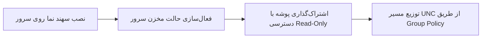

# راهنمای استقرار در شبکه و سرورهای سازمانی (Enterprise Deployment Guide)

**نرم‌افزار سهند نما (Sahand Nama)**  
**نسخه:** 1.4.0  
**شرکت سازنده:** راهکار الکترونیک سهند ([https://irres.ir](https://irres.ir))

---

## ۱. اهداف معماری Enterprise Hub

در سازمان‌ها و شرکت‌هایی که ده‌ها یا صدها کامپیوتر کلاینت ویندوزی دارند، دانلود روزانه تصاویر با کیفیت 4K توسط تک‌تک کلاینت‌ها منجر به هدررفت پهنای باند اینترنت و هزینه‌های اضافی می‌شود.

**مزایای استفاده از حالت سرور سهند نما:**
1. **مصرف اینترنت نزدیک به صفر در کلاینت‌ها:** تنها سرور تصاویر را دانلود می‌کند.
2. **یکپارچگی بصری:** امکان تنظیم یک تصویر واحد یا گالری سازمانی مشخص برای تمام پرسنل.
3. **سرعت بارگذاری آنی:** انتقال تصاویر از طریق شبکه داخلی LAN (گیگابیتی) با کسری از ثانیه.
4. **عدم نیاز به دسترسی اینترنت کلاینت‌ها:** کامپیوترهای ایزوله که به دلایل امنیتی به اینترنت دسترسی ندارند نیز می‌توانند تصاویر روز را دریافت کنند.

---

## ۲. گام‌های راه‌اندازی سرور (Server Setup)



### گام اول: اجرای برنامه روی ویندوز سرور
برنامه به طور خودکار نوع سیستم‌عامل سرور (Windows Server 2019 / 2022 / 2025) را تشخیص می‌دهد. در پنجره برنامه، به تب **«منابع و برنامه‌ریزی»** رفته و تیک **«فعال‌سازی حالت مخزن سرور شبکه»** را بزنید.

### گام دوم: ایجاد پوشه اشتراکی (SMB Share)
روی دکمه **«پوشه مخزن در سرور»** کلیک کنید تا پوشه تصاویر باز شود. سپس با یکی از دو روش زیر آن را Share کنید:

#### از طریق PowerShell در سرور (دسترسی Administrator):
```powershell
New-SmbShare -Name "Wallpapers" -Path "$env:LOCALAPPDATA\BingWallpaperPro\Images" -ReadAccess "Everyone"
```

### گام سوم: کپی آدرس UNC
روی دکمه **«کپی آدرس UNC برای کلاینت‌ها»** کلیک کنید. آدرس تولید شده به صورت زیر خواهد بود:
```
\\SERVER-NAME\Wallpapers
```

---

## ۳. تنظیم کلاینت‌ها از طریق Group Policy (GPO) یا اسکریپت ورود

جهت استقرار خودکار روی تمام کلاینت‌های دامین اکتیو دایرکتوری (Active Directory)، می‌توانید فایل اجرایی مستقل `BingWallpaperPro.exe` را در یک مسیر مشترک قرار داده و از طریق اسکریپت لاگین یا زمان‌بندی گروهی فراخوانی نمایید:

### دستور اجرای بی‌صدا (Silent Automation):
```cmd
BingWallpaperPro.exe --update-quiet
```

### نمونه اسکریپت لاگین کلاینت‌ها (`LogonScript.ps1`):
```powershell
# استقرار تنظیمات اولیه برای استفاده از سرور داخلی
$configPath = "$env:LOCALAPPDATA\BingWallpaperPro\settings.json"
$targetDir = "$env:LOCALAPPDATA\BingWallpaperPro"

if (-not (Test-Path $targetDir)) {
    New-Item -ItemType Directory -Path $targetDir -Force | Out-Null
}

$settings = @{
    DesktopSource = "SharedNetwork"
    DesktopFolderPath = "\\SERVER-NAME\Wallpapers"
    LockSource = "SharedNetwork"
    LockFolderPath = "\\SERVER-NAME\Wallpapers"
    Mode = "Same"
    AutoUpdateDesktop = $true
    AutoUpdateLockScreen = $true
} | ConvertTo-Json -Depth 5

Set-Content -Path $configPath -Value $settings -Encoding UTF8
```

---

## ۴. پرسش‌های متداول سازمانی

**سؤال: اگر ارتباط شبکه با سرور قطع شود چه اتفاقی می‌افتد؟**  
پاسخ: نرم‌افزار به صورت خودکار آخرین تصویر موجود در کش محلی کلاینت را حفظ می‌کند و هیچ خللی در عملکرد سیستم‌عامل کاربر ایجاد نمی‌شود.

**سؤال: آیا کلاینت‌ها امکان تغییر عکس را دارند؟**  
پاسخ: مدیر شبکه می‌تواند با تنظیم قفل سیاست‌های سازمانی، اعمال عکس را اجباری کند یا به کاربران اجازه انتخاب از میان تصاویر موجود در مخزن سرور را بدهد.
