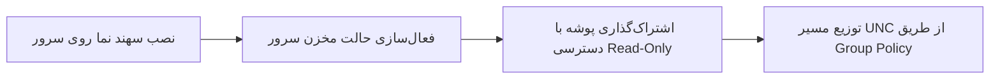

<div dir="rtl" align="right" style="font-family: 'Vazirmatn', Tahoma, -apple-system, BlinkMacSystemFont, 'Segoe UI', Roboto, sans-serif; line-height: 1.8;">

# راهنمای استقرار در شبکه و سرورهای سازمانی (Enterprise Deployment Guide)

**نرم‌افزار سهند نما (Sahand Nama)**  
**نسخه:** 1.8.1
**شرکت سازنده:** راهکار الکترونیک سهند ([https://irres.ir](https://irres.ir))

---

## ۱. اهداف معماری Enterprise Hub

در سازمان‌ها و شرکت‌هایی که ده‌ها یا صدها کامپیوتر کلاینت ویندوزی دارند، دانلود روزانه تصاویر با کیفیت 4K توسط تک‌تک کلاینت‌ها منجر به هدررفت پهنای باند اینترنت و هزینه‌های اضافی می‌شود.

**مزایای استفاده از حالت سرور سهند نما:**
1. **مصرف اینترنت نزدیک به صفر در کلاینت‌ها:** تنها سرور تصاویر را دانلود می‌کند.
2. **یکپارچگی بصری:** امکان تنظیم یک تصویر واحد یا گالری سازمانی مشخص برای تمام پرسنل.
3. **سرعت بارگذاری آنی:** انتقال تصاویر از طریق شبکه داخلی LAN (گیگابیتی) با کسری از ثانیه.
4. **عدم نیاز به دسترسی اینترنت کلاینت‌ها:** کامپیوترهای ایزوله که به دلایل امنیتی به اینترنت دسترسی ندارند نیز می‌توانند تصاویر روز را دریافت کنند.

---

## ۲. گام‌های راه‌اندازی سرور (Server Setup)



### گام اول: اجرای برنامه روی ویندوز سرور
برنامه به طور خودکار نوع سیستم‌عامل سرور (Windows Server 2019 / 2022 / 2025) را تشخیص می‌دهد. در پنجره برنامه، به تب **«منابع و برنامه‌ریزی»** رفته و تیک **«فعال‌سازی حالت مخزن سرور شبکه»** را بزنید.

### گام دوم: ایجاد پوشه اشتراکی (SMB Share)
روی دکمه **«ایجاد و فعال‌سازی Share در ویندوز»** کلیک کنید تا پوشه به صورت خودکار با دسترسی استاندارد Read-Only در شبکه به اشتراک گذاشته شود، یا از دستور PowerShell زیر با دسترسی مدیر استفاده نمایید:

```powershell
New-SmbShare -Name "Wallpapers" -Path "$env:LOCALAPPDATA\BingWallpaperPro" -ReadAccess "Everyone"
```

### گام سوم: آدرس UNC برای کلاینت‌ها
آدرس شبکه تولید شده برای کلاینت‌ها به صورت زیر در دسترس خواهد بود:
```
\\SERVER-NAME\Wallpapers
```

---

## ۳. تنظیم کلاینت‌ها از طریق Group Policy (GPO) یا اسکریپت ورود

جهت استقرار خودکار روی تمام کلاینت‌های دامین اکتیو دایرکتوری (Active Directory)، می‌توانید فایل اجرایی مستقل `SahandNama.exe` را در یک مسیر مشترک قرار داده و از طریق اسکریپت لاگین یا زمان‌بندی گروهی فراخوانی نمایید:

### دستور اجرای بی‌صدا (Silent Automation):
```cmd
"\\SERVER-NAME\Wallpapers\SahandNama.exe" --update
```

### ثبت زمان‌بندی روزانه خودکار روی کلاینت‌ها:
```cmd
"\\SERVER-NAME\Wallpapers\SahandNama.exe" --install-schedule 08:30
```

### نمونه الگوی فایل تنظیمات کلاینت (`%LOCALAPPDATA%\BingWallpaperPro\settings.json`):
```json
{
  "Mode": "Same",
  "DesktopSource": "SharedNetwork",
  "NetworkSharePath": "\\\\SERVER-NAME\\Wallpapers",
  "LockSource": "SharedNetwork",
  "LockNetworkSharePath": "\\\\SERVER-NAME\\Wallpapers",
  "DailyTime": "08:30",
  "Desktop": true,
  "LockScreen": true
}
```

---

## ۴. پرسش‌های متداول سازمانی

**سؤال: اگر ارتباط شبکه با سرور قطع شود چه اتفاقی می‌افتد؟**  
پاسخ: نرم‌افزار به صورت خودکار آخرین تصویر موجود در کش محلی کلاینت را حفظ می‌کند و هیچ خللی در عملکرد سیستم‌عامل کاربر ایجاد نمی‌شود.

**سؤال: آیا کلاینت‌ها امکان تغییر عکس را دارند؟**  
پاسخ: مدیر شبکه می‌تواند با تنظیم قفل سیاست‌های سازمانی، اعمال عکس را اجباری کند یا به کاربران اجازه انتخاب از میان تصاویر موجود در مخزن سرور را بدهد.

برای توزیع آرشیو سرویس مستقل، Share جداگانه‌ای از `%ProgramData%\BingWallpaperPro\Feed` با دسترسی خواندن بسازید. Share رابط کاربری به آرشیو کاربر در LocalAppData اشاره می‌کند و با مخزن سرویس یکسان نیست. همگام‌سازی ناقص با وضعیت خطا گزارش می‌شود؛ فایل‌های موفق حفظ می‌شوند.

</div>


تلاش مجدد: سرویس پس از sync ناموفق یک ساعت بعد تلاش می‌کند (پس از موفقیت ۱۲ ساعت). task ثبت‌شده توسط برنامه با `--update --scheduled` اجرا می‌شود؛ شکست آنلاین حتی با استفاده از cache کد ۱ می‌دهد و تا ۲۴ بار با فاصلهٔ یک ساعت retry می‌شود. trigger روزانه و ورود کاربر حفظ شده‌اند؛ اجرا بدون نشست تعاملی/هنگام sleep تضمین نمی‌شود.
