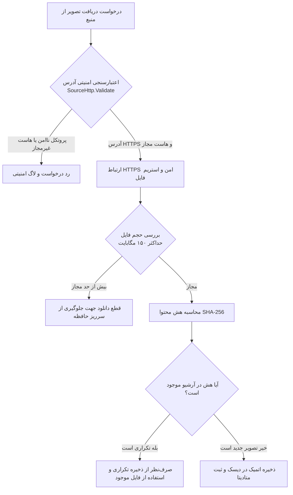

<div dir="rtl" align="right" style="font-family: 'Vazirmatn', Tahoma, -apple-system, BlinkMacSystemFont, 'Segoe UI', Roboto, sans-serif; line-height: 1.8;">

# مستندات منابع داده، APIها و الگوریتم یکتاسازی (Sources & API Documentation)

**نرم‌افزار سهند نما (Sahand Nama)**  
**نسخه:** 1.7.0  
**توسعه‌دهنده:** شرکت راهکار الکترونیک سهند ([https://irres.ir](https://irres.ir))

---

## ۱. فهرست و مشخصات منابع آنلاین معتبر

نرم‌افزار سهند نما مستقیماً و بدون وابستگی به API Key پولی، از معتبرترین فیدها و APIهای رسمی استفاده می‌کند:

| شناسه منبع (`Id`) | نام نمایشی فارسی | نوع فرمت داده | هاست مجاز (Allowlisted Host) | حداکثر کیفیت |
| :--- | :--- | :--- | :--- | :--- |
| `Bing` | تصویر روز مایکروسافت بینگ | JSON API | `www.bing.com` | UHD (4K) |
| `BingGlobal` | گلچین بین‌المللی بینگ (همه مناطق) | Multi-JSON | `www.bing.com` | UHD (4K) |
| `IranNature` | ایران زیبا (طبیعت و آثار باستانی) | Curated CDN | `upload.wikimedia.org` | UHD (1920x1080+) |
| `Wallhaven` | والپیپرهای برگزیده ۴K و ۸K | Direct CDN | `w.wallhaven.cc`, `th.wallhaven.cc` | 4K / 8K UHD |
| `MuseumArt` | شاهکارهای هنر کلاسیک (موزه شیکاگو) | IIIF / REST | `www.artic.edu`, `api.artic.edu` | High-Res Art |
| `NatGeoNature` | طبیعت و حیات‌وحش نشنال جئوگرافیک | Direct CDN | `images.unsplash.com` | 4K UHD |
| `CyberpunkArt` | شهر آینده و هنر سایبرپانک (۴K) | Direct CDN | `images.unsplash.com` | 4K UHD |
| `Architecture4K` | شاهکارهای معماری مدرن جهان | Direct CDN | `images.unsplash.com` | 4K UHD |
| `UnsplashNature` | عکس‌های برگزیده طبیعت Unsplash | REST / Direct | `picsum.photos`, `images.unsplash.com` | 4K (3840x2160) |
| `WikimediaPotd` | تصویر برگزیده روز ویکی‌مدیا | MediaWiki Action API | `commons.wikimedia.org`, `upload.wikimedia.org` | Full Original |
| `UsgsEarthArt` | شگفتی‌های زمین از فضا (USGS) | RSS / XML Feed | `eros.usgs.gov`, `landsat.usgs.gov` | High-Res Satellite |
| `NasaDaily` | تصویر نجومی روز ناسا (APOD) | RSS / JSON | `www.nasa.gov`, `images-assets.nasa.gov` | Ultra HD |
| `NasaLibrary` | کتابخانه تصاویر نجومی ناسا | REST API | `images-api.nasa.gov` | Ultra HD |
| `EsaHubble` | تصاویر تلسکوپ هابل و وب (ESA) | RSS 2.0 Feed | `esahubble.org`, `cdn.esahubble.org` | 4K / Full Res |
| `Spotlight` | مایکروسافت اسپات‌لایت (کش محلی) | Local Cache | دیسک سیستم | کیفیت اصلی |
| `SharedNetwork` | مخزن اشتراکی سرور در شبکه | UNC SMB | `\\<SERVER>\<SHARE>` | کیفیت اصلی |
| `Folder` | پوشه شخصی در رایانه | Local File System | دیسک محلی | کیفیت اصلی |
| `Favorites` | تصاویر نشان‌شده در علاقه‌مندی‌ها | Local Archive | دیسک محلی | کیفیت اصلی |

---

## ۲. مستندات وب‌سرویس وضعیت آب‌وهوا (Open-Meteo Integration)

نرم‌افزار برای نمایش وضعیت لحظه‌ای آب‌وهوا در ویجت دسکتاپ از وب‌سرویس عمومی و رایگان **Open-Meteo** استفاده می‌کند:
- **نقطه نهایی (Endpoint):**
  ```
  https://api.open-meteo.com/v1/forecast?latitude={lat}&longitude={lon}&current=temperature_2m,relative_humidity_2m,weather_code,wind_speed_10m&timezone=auto
  ```
- **ویژگی‌های معماری:**
  - بدون نیاز به ثبت‌نام یا API Key اختصاصی.
  - نگاشت مختصات جغرافیایی بیش از ۳۵ کلان‌شهر و مرکز استان ایران (تهران، تبریز، مشهد، اصفهان، شیراز، اهواز، رشت، کیش و...).
  - سیستم کش هوشمند محلی به مدت ۱۵ دقیقه جهت کاهش بار شبکه.
  - تبدیل خودکار WMO Weather Codes به برچسب‌های فارسی و ایموجی‌های هواشناسی (صاف و آفتابی ☀️، نیمه ابری ⛅، مه 🌫️، بارانی 🌧️، رعد و برق ⛈️، برف ❄️).

---

## ۳. دیاگرام جریان دریافت و اعتبارسنجی امنیتی شبکه



---

## ۴. الگوریتم یکتاسازی محتوا و پاک‌سازی فایل‌های تکراری (SHA-256 Deduplication)

برای اطمینان از اینکه هیچ تصویر تکراری حتی با نام فایل یا URL متفاوت دوباره بر روی دیسک ذخیره نشود:

1. **محاسبه هش محتوا:** پیش از نهایی‌سازی فایل، هش `SHA-256` بایت‌های تصویر محاسبه می‌شود.
2. **بررسی پایگاه داده آرشیو:** اگر فایلی با همان هش در `archive.json` ثبت شده باشد، فرآیند دانلود متوقف شده و فایل موجود استفاده می‌گردد.
3. **متد `PurgeDuplicates`:** با فراخوانی این متد، تمام فایل‌های موجود در پوشه تصاویر اسکن شده، فایل‌های همسان شناسایی شده و فقط نسخه اصلی (Canonical) حفظ و فایل‌های تکراری حذف می‌گردند.

---

## ۵. ساختار متادیتای تصاویر (`archive.json`)

```json
[
  {
    "Id": "9b1a5e78c9a3",
    "Source": "Bing",
    "SourcePage": "https://www.bing.com/...",
    "Title": "دامنه‌های کوهستان سهند و دره باستانی کندوان",
    "Copyright": "طبیعت آذربایجان شرقی • رشته‌کوه سهند",
    "Date": "20261002",
    "Url": "https://upload.wikimedia.org/...",
    "Market": "fa-IR",
    "FilePath": "C:\\Users\\...\\AppData\\Local\\BingWallpaperPro\\Images\\9b1a5e78c9a3.jpg"
  }
]
```

</div>
