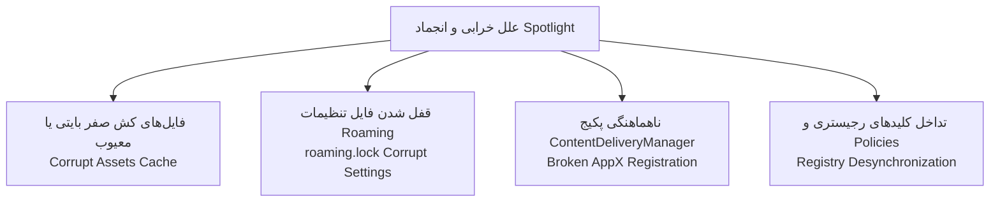
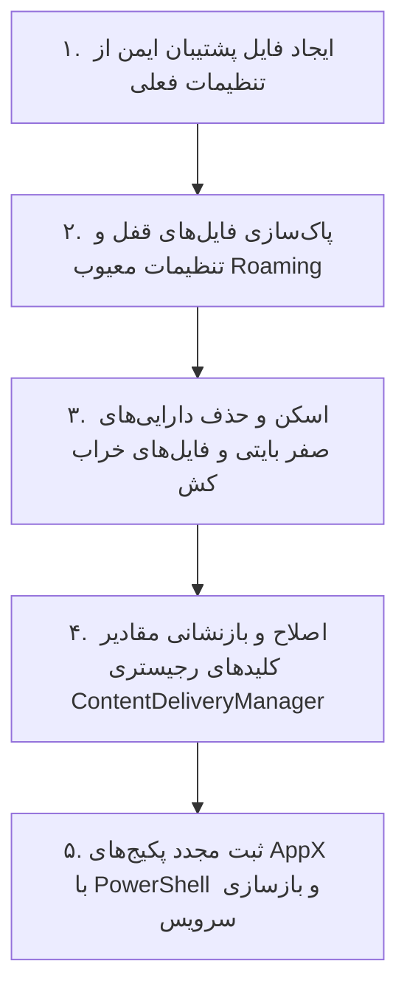

# راهنمای جامع عیب‌یابی و رفع خودکار ایرادات ویندوز Spotlight و صفحه قفل

**نرم‌افزار سهند نما (Sahand Nama)**  
**نسخه:** 1.4.0  
**توسعه‌دهنده:** شرکت راهکار الکترونیک سهند ([https://irres.ir](https://irres.ir))

---

## ۱. ساختار داخلی Windows Spotlight و علل بروز خرابی

سرویس **Windows Spotlight** وظیفه بارگذاری تصاویر روزانه از سرورهای مایکروسافت و نمایش آن‌ها بر روی صفحه قفل (Lock Screen) را دارد. این سرویس در نسخه‌های مختلف ویندوز ۱۰ و ۱۱ به دلایل زیر مکرراً دچار اختلال می‌شود:



### علائم متداول خرابی Spotlight:
1. نمایش یک تصویر ثابت و عدم تغییر تصویر پس از روزها یا ماه‌ها.
2. نمایش صفحه قفل کاملاً خاکستری، مشکی یا آبی بدون تصویر.
3. عدم واکنش به دکمه «آیا این تصویر را دوست دارید؟» (Like what you see?).
4. بازگشت خودکار تنظیمات لاک‌اسکرین به حالت «Picture» پس از ریستارت.

---

## ۲. راهکار ۵ مرحله‌ای و هوشمند خودترمیمی سهند نما

نرم‌افزار سهند نما در متد [WindowsIntegration.ResetSpotlightAsync](file:///c:/Users/Taimazus/Desktop/SetWinWallpaper/BingWallpaperPro/WindowsIntegration.cs#L170) یک فرآیند تعمیر بنیادین و خودکار را اجرا می‌کند:



### شرح فنی مراحل:

#### مرحله ۱: پشتیبان‌گیری خودکار (Safety First)
پیش از هرگونه تغییر، یک کپی از فایل‌های وضعیت در پوشه `Backups` در مسیر AppData کاربر ذخیره می‌شود.

#### مرحله ۲: پاک‌سازی فایل‌های قفل Roaming
فایل‌های معیوب `settings.dat` و `roaming.lock` در مسیر زیر حذف یا ریست می‌شوند:
```
%LOCALAPPDATA%\Packages\Microsoft.Windows.ContentDeliveryManager_cw5n1h2txyewy\Settings
```

#### مرحله ۳: پالایش پوشه Assets
فایل‌های تصویری ناقص که کمتر از ۱۰ کیلوبایت هستند از مسیر دارایی‌ها پاک می‌شوند:
```
%LOCALAPPDATA%\Packages\Microsoft.Windows.ContentDeliveryManager_cw5n1h2txyewy\LocalState\Assets
```

#### مرحله ۴: همگام‌سازی کلیدهای رجیستری
کلیدهای اشتراک روزانه در مسیر زیر تصحیح و مقداردهی می‌شوند:
```
HKCU\Software\Microsoft\Windows\CurrentVersion\ContentDeliveryManager
  - RotatingLockScreenEnabled = 1
  - RotatingLockScreenOverlayEnabled = 1
  - SubscribedContent-338387Enabled = 1
```

#### مرحله ۵: ثبت مجدد پکیج AppX
اجرای دستور ثبت مجدد بومی پکیج بدون نیاز به اینترنت:
```powershell
Get-AppxPackage Microsoft.Windows.ContentDeliveryManager | Reset-AppxPackage
```

---

## ۳. نحوه استفاده از داخل نرم‌افزار

1. وارد تب **«سلامت، عیب‌یابی و رفع ایراد»** شوید.
2. روی دکمه **«رفع خودکار تمام ایرادات»** کلیک کنید.
3. برنامه ظرف چند ثانیه تمامی گام‌های فوق را به همراه بررسی تنظیمات، زمان‌بندی و آرشیو تصاویر انجام داده و گزارش تایید را نمایش می‌دهد.
4. در صورت نیاز به بازنشانی اختصاصی Spotlight، روی دکمه **«بازنشانی کامل Spotlight…»** کلیک فرمایید.
