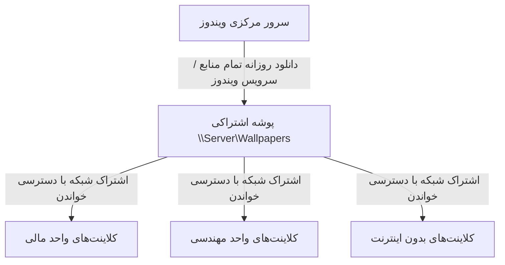

<div dir="rtl" align="right" style="font-family: 'Vazirmatn', Tahoma, -apple-system, BlinkMacSystemFont, 'Segoe UI', Roboto, sans-serif; line-height: 1.8;">

# راهنمای مدیران سیستم و شبکه (System Administrator Guide)

این راهنما ویژه مدیران شبکه، ادمین‌های ویندوز سرور و مسئولان IT سازمان‌ها جهت استقرار بهینه **سهند نما (Sahand Nama)** در سطح شبکه سازمانی تهیه شده است.

---

## ۱. نقشه راه استقرار متمرکز (Centralized Deployment Flow)



---

## ۲. دستورالعمل پیکربندی سرور

1. برنامه را روی سرور اجرا کنید.
2. به تب **منابع و برنامه‌ریزی** رفته و تیک **«فعال‌سازی حالت مخزن سرور شبکه»** را فعال کنید.
3. با کلیک روی دکمه **«ایجاد و فعال‌سازی Share در ویندوز»** یا اجرای دستور زیر با دسترسی مدیر، پوشه به صورت SMB به اشتراک گذاشته می‌شود:
   ```powershell
   New-SmbShare -Name "Wallpapers" -Path "$env:LOCALAPPDATA\BingWallpaperPro" -ReadAccess "Everyone"
   ```
4. با زدن دکمه **«همگام‌سازی تمامی گالری‌ها اکنون»** یا سویچ `--sync-all`، تمامی فیدها به صورت یکجا دریافت و آماده توزیع می‌شوند.

---

## ۳. استقرار روی کلاینت‌ها با Group Policy (GPO)

جهت اعمال بدون دخالت کاربر، فایل `SahandNama.exe` را در مسیر `\\Server\Wallpapers` قرار داده و یک GPO با مشخصات زیر بسازید:

### تنظیم Startup / Logon Script:
```cmd
"\\Server\Wallpapers\SahandNama.exe" --update
```

### نصب خودکار زمان‌بندی روزانه روی کلاینت:
```cmd
"\\Server\Wallpapers\SahandNama.exe" --install-schedule 08:30
```

### الگوی فایل تنظیمات کلاینت (`%LOCALAPPDATA%\BingWallpaperPro\settings.json`):
```json
{
  "Mode": "Same",
  "DesktopSource": "SharedNetwork",
  "DesktopFolder": "\\\\Server\\Wallpapers",
  "LockSource": "SharedNetwork",
  "LockFolder": "\\\\Server\\Wallpapers",
  "DailyTime": "08:30",
  "Desktop": true,
  "LockScreen": true
}
```

---

## ۴. مدیریت سرویس پس‌زمینه در سطح سیستم (System-Wide Service)

در سناریوهایی که سرور نباید وابسته به لاگین کاربر باشد، می‌توانید سرویس اختصاصی را مستقیماً فعال کنید:
```cmd
SahandNama.exe --install-service
```
این سرویس با نام `BingWallpaperProFeed` اجرا شده و فایل‌ها را در مسیر عمومی `%ALLUSERSPROFILE%\BingWallpaperPro\Feed\` ذخیره می‌کند.

</div>
