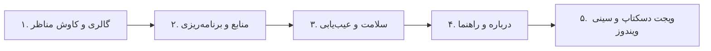

# راهنمای کاربری سهند نما (User Guide)

**سهند نما** دستیار هوشمند شما برای دگرگون‌سازی فضای دسکتاپ و صفحه قفل ویندوز با زیباترین مناظر جهان، ویجت دسکتاپ شیشه‌ای و پایش زنده سیستم است.

---

## ۱. آشنایی با تب‌ها و بخش‌های برنامه

### ۱. تب گالری و کاوش مناظر (Gallery)
- **انتخاب منبع سریع:** از منوی کشویی، منبع مورد نظر (بینگ، ایران زیبا، وال‌هیون، موزه شیکاگو، تصاویر برگزیدهٔ ویکی‌مدیا، ناسا، هابل، Unsplash، ویکی‌مدیا یا USGS) را انتخاب و روی «دریافت تصاویر منبع» کلیک کنید.
- **مشاهده و پیش‌نمایش:** روی هر تصویر از لیست راست‌کلیک کنید تا پیش‌نمایش باکیفیت به همراه عنوان، توضیح و عکاس اثر نمایش یابد.
- **اعمال تصویر:** با کلیک روی «اعمال روی دسکتاپ» یا «اعمال روی لاک‌اسکرین»، تصویر در همان لحظه بدون نیاز به ریستارت فعال می‌شود.
- **علاقه‌مندی‌ها و ذخیره:** تصویر را به لیست نشان‌شده‌ها اضافه کنید یا با دکمه «ذخیره تصویر» در هر پوشه‌ای با کیفیت اصلی ذخیره نمایید.
- **ساخت کارت شبکه‌های اجتماعی:** با دکمه «تولید کارت اشتراک‌گذاری»، تصویر با تاریخ شمسی و کادر گرافیکی آماده انتشار می‌شود.

---

### ۲. تب منابع و برنامه‌ریزی (Sources & Schedule)
- **روش انتخاب تصویر:**
  - *تصویر یکسان:* هر دو بخش دسکتاپ و لاک‌اسکرین یک منظره مشترک داشته باشند.
  - *لاک‌اسکرین قبلی:* دسکتاپ تصویر امروز و لاک‌اسکرین تصویر دیروز باشد.
  - *انتخاب مستقل:* مثلاً دسکتاپ از عکس‌های طبیعت ایران و لاک‌اسکرین از تصاویر نجومی هابل باشد.
- **زمان‌بندی خودکار:** ساعت دلخواه را وارد کرده و روی «فعال‌سازی / اصلاح زمان‌بندی» کلیک کنید.
- **تنظیمات مدرن:** فعال‌سازی کلیدهای میانبر، هماهنگی رنگ تم ویندوز (Accent Color) و پنهان‌سازی آیکون‌های دسکتاپ.

---

### ۳. تب سلامت، عیب‌یابی و رفع ایراد (Diagnostics)
- با کلیک روی **«شروع عیب‌یابی کامل»**، وضعیت کلیه اجزای ویندوز، تسک‌ها، کلیدهای رجیستری و سرویس‌ها سنجیده می‌شود.
- در صورت وجود هرگونه مشکل، کافی است روی **«رفع خودکار تمام ایرادات»** کلیک کنید تا کلیه خطاها رفع و سیستم نوسازی شود.

---

### ۴. کار با ویجت شیشه‌ای دسکتاپ (True Acrylic Glass Widget)
- **فعال‌سازی:** تیک «نمایش ویجت شیشه‌ای دسکتاپ» را در برنامه بزنید یا از سینی ویندوز فعال کنید.
- **جابجایی و چسبندگی:** با ماوس ویجت را بکشید؛ با نزدیک شدن به لبه‌های مانیتور به طور خودکار می‌چسبد (Snap).
- **تنظیم شفافیت:** از منوی راست‌کلیک ویجت، میزان شفافیت پس‌زمینه را از ۳۰٪ تا ۱۰۰٪ تنظیم کنید.
- **تغییر حالت الصاق (Pin Mode):**
  - 🪟 **Desktop:** چسبیده به پس‌زمینه دسکتاپ زیر تمام پنجره‌ها.
  - 🔲 **Normal:** پنجره عادی.
  - 📌 **TopMost:** همیشه روی تمام پنجره‌ها.
- **وضعیت آب‌وهوا:** شهر خود را در تنظیمات انتخاب کنید؛ با کلیک روی چیپ آب‌وهوا اطلاعات فوراً به‌روزرسانی می‌شود.
- **پایش سخت‌افزار:** نمایش زنده مصرف پردازنده، رم و باتری لپ‌تاپ.

---

### ۵. سینی ویندوز و کلیدهای میانبر (System Tray & Hotkeys)
- **بستن پنجره [✕]:** برنامه بسته نمی‌شود بلکه به سینی کنار ساعت منتقل می‌شود.
- **کلید `Win + Alt + W`:** تعویض فوری تصویر پس‌زمینه.
- **کلید `Win + Alt + S`:** افزودن تصویر فعلی به علاقه‌مندی‌ها.
- **خروج کامل:** راست‌کلیک روی آیکون کنار ساعت و انتخاب **«🚪 خروج کامل از برنامه»**.

