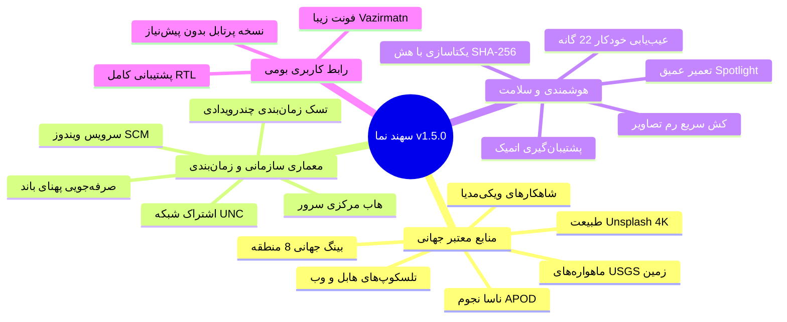

# دانشنامه و راهنمای جامع سهند نما (Sahand Nama Wiki)

به دانشنامه رسمی نرم‌افزار **سهند نما (Sahand Nama)** خوش آمدید.  
این پروژه توسط **شرکت راهکار الکترونیک سهند** ([https://irres.ir](https://irres.ir)) توسعه داده شده است.

---

## 📚 ساختار دانشنامه و راهنماها

- 📖 **[راهنمای کاربری (User Guide)](User-Guide.md):** راهنمای جامع استفاده از محیط گرافیکی، انتخاب منابع، پیش‌نمایش، ذخیره و علاقه‌مندی‌ها.
- 🛡️ **[راهنمای مدیران سیستم و شبکه (Admin Guide)](Admin-Guide.md):** راه‌اندازی حالت Enterprise Server Hub، اشتراک شبکه (UNC Share)، تنظیمات Group Policy و سرویس ویندوز.
- 💻 **[راهنمای توسعه‌دهندگان (Developer Guide)](Developer-Guide.md):** ساختار سورس‌کد، فرآیند کامپایل، اجرای آزمون‌های ۵۷ گانه و اضافه کردن منابع جدید.
- 📐 **[معماری فنی و دیاگرام‌ها](../docs/ARCHITECTURE.md):** تحلیل عمیق جریان داده‌ها، الگوهای طراحی، مدیریت ریسمان‌ها و تعامل با Win32.
- 🔍 **[مرجع عیب‌یابی و تعمیر Spotlight](../docs/SPOTLIGHT_TROUBLESHOOTING.md):** بررسی ساختار بسته‌های ContentDeliveryManager و مکانیزم خودترمیمی.

---

## 🌟 ویژگی‌های کلیدی سهند نما v1.5.0

