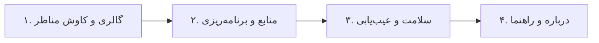

# راهنمای کاربری سهند نما (User Guide)

**سهند نما** دستیار هوشمند شما برای دگرگون‌سازی فضای دسکتاپ و صفحه قفل ویندوز با زیباترین مناظر جهان است.

---

## ۱. آشنایی با تب‌ها و بخش‌های برنامه

### ۱. تب گالری و کاوش مناظر (Gallery)
- **انتخاب منبع سریع:** از منوی کشویی، منبع مورد نظر (بینگ، ناسا، Unsplash، ویکی‌مدیا یا USGS) را انتخاب و روی «دریافت تصاویر منبع» کلیک کنید.
- **مشاهده و پیش‌نمایش:** روی هر تصویر از لیست راست کلیک کنید تا پیش‌نمایش باکیفیت به همراه عنوان، توضیح و عکاس اثر نمایش یابد.
- **اعمال تصویر:** با کلیک روی «اعمال روی دسکتاپ» یا «اعمال روی لاک‌اسکرین»، تصویر در همان لحظه بدون نیاز به ریستارت فعال می‌شود.
- **علاقه‌مندی‌ها و ذخیره:** تصویر را به لیست نشان‌شده‌ها اضافه کنید یا با دکمه «ذخیره تصویر» در هر پوشه‌ای با کیفیت اصلی ذخیره نمایید.

---

### ۲. تب منابع و برنامه‌ریزی (Sources & Schedule)
- **روش انتخاب تصویر:**
  - *تصویر یکسان:* هر دو بخش دسکتاپ و لاک‌اسکرین یک منظره مشترک داشته باشند.
  - *لاک‌اسکرین قبلی:* دسکتاپ تصویر امروز و لاک‌اسکرین تصویر دیروز باشد.
  - *انتخاب مستقل:* مثلاً دسکتاپ از عکس‌های طبیعت Unsplash و لاک‌اسکرین از تصاویر نجومی ناسا باشد.
- **زمان‌بندی خودکار:** ساعت دلخواه را وارد کرده و روی «فعال‌سازی / اصلاح زمان‌بندی» کلیک کنید.

---

### ۳. تب سلامت، عیب‌یابی و رفع ایراد (Diagnostics)
- با کلیک روی **«شروع عیب‌یابی کامل»**، وضعیت کلیه اجزای ویندوز سنجیده می‌شود.
- در صورت وجود هرگونه مشکل، کافی است روی **«رفع خودکار تمام ایرادات»** کلیک کنید تا کلیه خطاها رفع و سیستم نوسازی شود.

---

### ۴. تب درباره و راهنما (About & Guide)
- مشاهده مشخصات نسخه ۱.۴.۰، اطلاعات شرکت راهکار الکترونیک سهند، باز کردن راهنمای تعاملی و دسترسی به پوشه فایل‌های داده برنامه.
